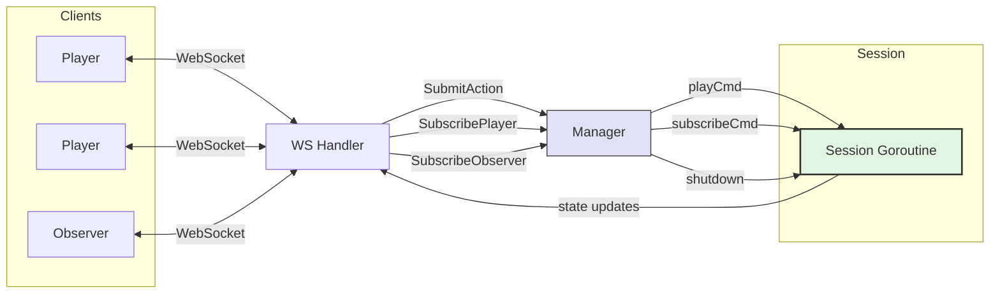
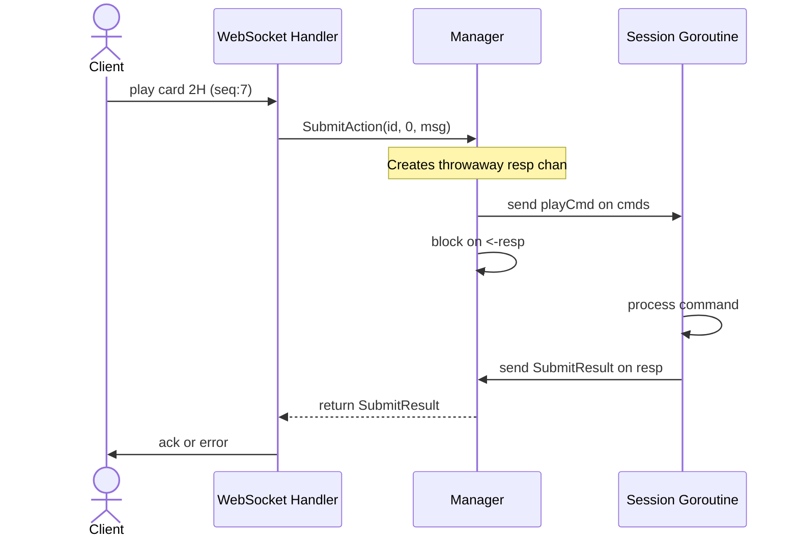
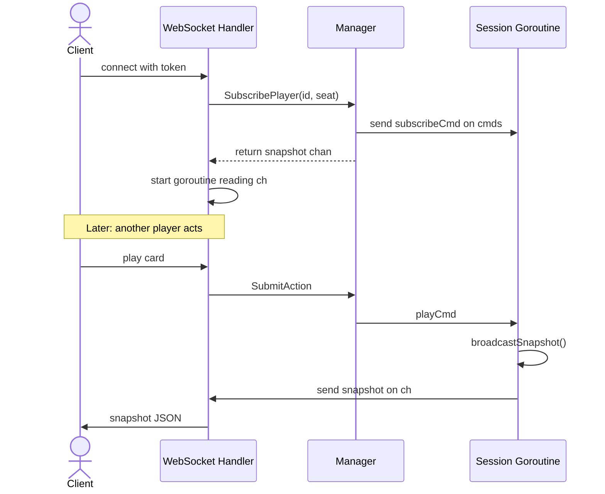
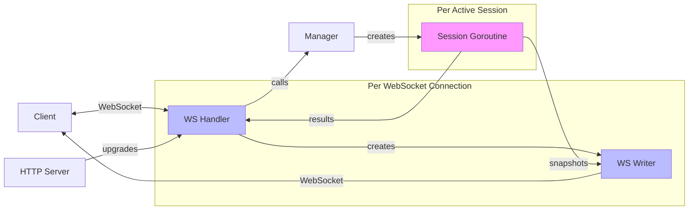

# System Architecture

## Package Structure

The project uses a `cmd/` + `internal/` layout: `cmd/` holds thin entry points for the server and client binaries, while `internal/api/` provides shared wire DTOs, `internal/server/` splits server logic into transport, session, and view layers, and `internal/client/` provides a protocol-agnostic client engine shared by the TUI and CLI.

```
github.com/jrgoldfinemiddleton/cardcore-server
├── cmd/
│   ├── server/              ← entry point: parse flags, wire deps, start HTTP listener
│   ├── tui/                 ← entry point: parse flags, connect WS, run Bubble Tea
│   └── client/              ← entry point: scripted or batch CLI client
├── internal/
│   ├── api/                 ← wire DTOs shared by server and clients (JSON structs)
│   ├── client/              ← shared client engine: HTTP lifecycle, WS connection, messages, errors
│   │   └── hearts/          ← Hearts-specific adapter, DTOs, and command builders
│   └── server/
│       ├── transport/       ← HTTP handlers, WebSocket upgrade, routing, message parsing
│       ├── session/         ← session lifecycle, game goroutine, token management, seq
│       └── view/            ← engine state → seat-filtered snapshot DTOs
```

## Data Flow

```
                    ┌─────────┐
                    │   TUI   │
                    └────┬────┘
                    ┌────┴────┐
                    │   CLI   │
                    └────┬────┘
                         │
                    ┌────┴────┐
                    │ Client  │  ← HTTP lifecycle, WS read loop, maxSeenSeq
                    │ Engine  │     (internal/client/, internal/client/hearts/)
                    └────┬────┘
                         │  HTTP/WS
                         │  JSON messages
                         ▼
               ┌───────────────────┐
               │      Server       │
               └─────────┬─────────┘
                         │
               ┌─────────┼─────────┐
               │         │         │
         transport/  session/    view/
               │         │         │
               │    ┌────┴────┐    │
               │    │cardcore │    │
               │    │ engine  │    │
               │    └─────────┘    │
               └───────────────────┘
```

1. **TUI** (interactive) or **CLI** (scripted/batch) calls into the **Client Engine** (`internal/client/`) for HTTP session management and WebSocket I/O.
2. The **Client Engine** sends player commands (`play_card`, `pass_cards`) as JSON over WebSocket and receives snapshot/error broadcasts, filtering duplicates via `maxSeenSeq`.
3. **Transport** accepts HTTP requests, upgrades WebSocket connections, parses inbound messages, and routes them to the appropriate session.
4. **Session** owns the game goroutine. It validates commands, applies them to the cardcore engine, runs AI turns, increments the seq counter, and broadcasts state changes.
5. **View** takes raw engine state and a seat index, produces a filtered snapshot DTO (hides opponents' hands, computes legal actions).
6. **Transport** serializes the snapshot and sends it to connected clients.

## Session Lifecycle

```
draft ──► active ──► finished
  │          │           │
  └──────────┴───────────┴──► expired (via DELETE or process exit)
```

- **Draft**: session created, config mutable, game not started.
- **Active**: game in progress, commands accepted.
- **Finished**: terminal game state reached (final snapshot sent).
- **Expired**: session torn down (DELETE endpoint or server shutdown).

## Concurrency Model

Each session runs in its own goroutine:

```
[transport goroutine]  ──── command channel ────►  [session goroutine]
                       ◄── snapshot broadcast ───
```

- Transport handlers are stateless — they parse, validate envelope structure, and enqueue.
- The session goroutine is the sole writer of game state. No mutexes needed.
- AI turns execute synchronously within the session goroutine, gated by a minimum delay.
- Observer connections subscribe to the snapshot broadcast; they never enqueue commands.

## Network Model

Localhost TCP on `127.0.0.1:0` — the OS picks a free port at startup. No unix sockets (not portable across OSes). The server prints the bound address on startup so the TUI can connect.

## Dependency Policy

External dependencies require explicit approval. The approved list lives in `doc/dependencies.md`. The `cardcore` engine is the only domain dependency; the Charm stack provides TUI rendering; `coder/websocket` provides WebSocket transport. All other functionality uses the Go standard library.

Dev tools (golangci-lint, pkgsite) are managed via the `tool` directive in `go.mod` and compiled automatically on first use.

## Session Goroutine Architecture

This section describes the goroutine and communication model for the Cardcore Server session layer.

### Overview



### Two Communication Patterns

#### Pattern 1: Synchronous (SubmitAction)

The WebSocket handler calls `Manager.SubmitAction()`, which blocks until the session goroutine responds.



#### Pattern 2: Asynchronous (SubscribePlayer)

The WebSocket handler gets a channel immediately and reads snapshots from it continuously.



### Goroutine Ownership



### Session Design Decisions

| Aspect | Choice | Why |
|--------|--------|-----|
| Manager | Struct with `sync.RWMutex` | Simple registry, no event loop needed |
| Session | Goroutine with `for { select {} }` | Owns game state, serializes mutations |
| Commands | Buffered `chan command` (size 64) | Decouples Manager from session goroutine |
| Response | Throwaway `chan SubmitResult` (size 1) | Enables synchronous call across goroutines |
| Snapshots | Buffered `chan []byte` (size 64) | Session broadcasts without blocking |
| Shutdown | `close(cancel)` then `close(done)` | Clean shutdown with exit confirmation |

### The Three Layers

| Layer | Goroutine? | Role |
|-------|-----------|------|
| `session.go` types | No | Wire format — JSON structs for HTTP/WebSocket |
| Manager | No | Registry — creates sessions, tracks state, starts/stops |
| Session (goroutine) | Yes | Game engine runner — processes actions, broadcasts state |

## Message Field Lifecycle (Example: Hearts)

What happens to each field as a client message flows through the system.

### Client JSON (what the client sends)

```json
{
  "type": "play_card",
  "action_id": "play-abc123",
  "seq": 7,
  "payload": {
    "card": {
      "rank": "2",
      "suit": "hearts"
    }
  }
}
```

### After Transport Parses (api.InboundMessage)

All fields preserved, `payload` becomes raw bytes:

```go
type InboundMessage struct {
    Type     string          // "play_card"
    ActionID string          // "play-abc123"
    Seq      int             // 7
    Payload  json.RawMessage // {"card":{"rank":"2","suit":"hearts"}}
}
```

### After Session Goroutine Processes

The session goroutine **consumes** three fields before calling the adapter. They are stripped from what the adapter sees:

| Field | Used For | Reaches Adapter? |
|-------|----------|-----------------|
| `type` | Dispatch to correct handler | Yes (adapter switches on this) |
| `action_id` | Deduplication (replay protection) | **No** — consumed by session |
| `seq` | Ordering check (stale detection) | **No** — consumed by session |

### After Adapter Parses Payload (heartsapi.PlayCardPayload)

The adapter unmarshals `InboundMessage.Payload` into the game-specific struct:

```go
type PlayCardPayload struct {
    Card Card `json:"card"`
}

type Card struct {
    Rank string `json:"rank"` // "2"
    Suit string `json:"suit"` // "hearts"
}
```

### Field Survivors Summary

| Original Field | Survives To Engine? | Where Consumed |
|----------------|---------------------|----------------|
| `type` | Partially (used for dispatch) | Transport → Adapter |
| `action_id` | **No** | Session goroutine (dedup) |
| `seq` | **No** | Session goroutine (ordering) |
| `payload.card.rank` | **Yes** → `Card.Rank` | Adapter → Engine |
| `payload.card.suit` | **Yes** → `Card.Suit` | Adapter → Engine |

### pass_cards (comparison)

```json
{
  "type": "pass_cards",
  "action_id": "pass-xyz789",
  "seq": 5,
  "payload": {
    "cards": [
      {"rank": "Q", "suit": "spades"},
      {"rank": "3", "suit": "hearts"},
      {"rank": "A", "suit": "diamonds"}
    ]
  }
}
```

Same stripping applies:
- `action_id` and `seq` consumed by session goroutine
- `type` used for dispatch
- `payload.cards[]` → `PassCardsPayload.Cards[]` → engine

### Design Principle

The generic envelope (`api.InboundMessage`) carries **cross-cutting concerns** (action_id, seq) that every game needs. The game-specific payload carries only **game data** (cards, moves, coordinates, etc.). The session layer handles the cross-cutting stuff so the game adapter doesn't have to care about replay detection or ordering.
